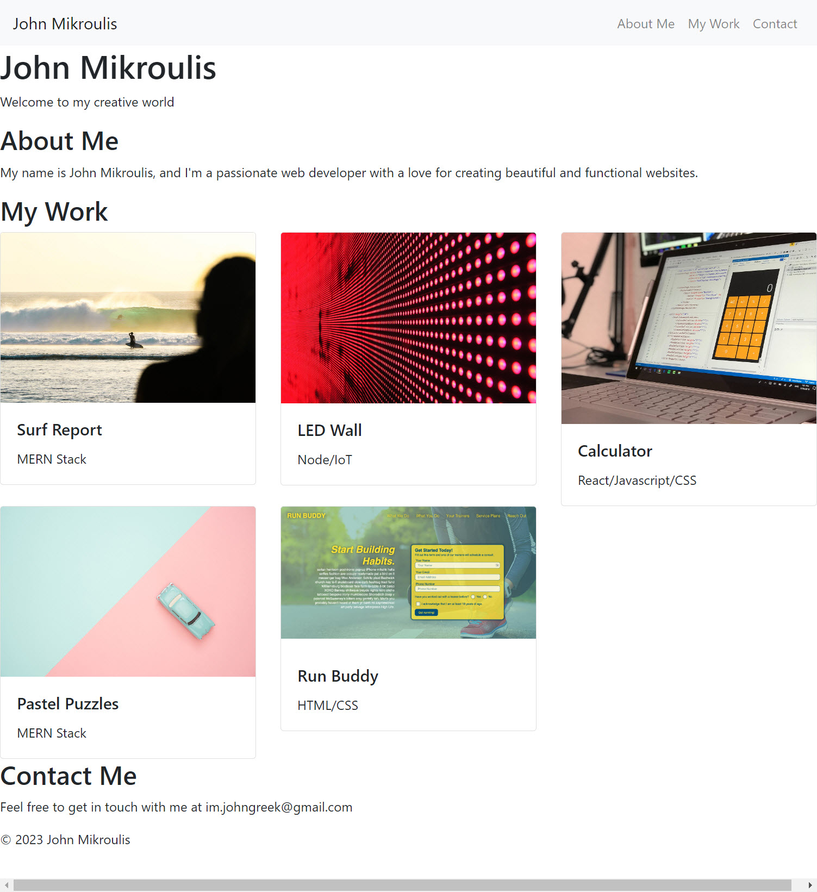

# Portfolio Website

This is my portfolio website, designed to showcase my projects, skills, and provide information about me. It's created to meet the needs of hiring managers, offering insights into my work and how to contact me. The website is also responsive, ensuring a seamless experience on different devices.

## Table of Contents

- [Description](#description)
- [Demo](#demo)
- [Installation](#installation)
- [Usage](#usage)
- [Screenshots](#screenshots)
- [Contributing](#contributing)
- [License](#license)

## Description

My portfolio website serves as an online resume, presenting my skills and featured projects. It provides an easy way to learn more about me and my work.

## Demo

You can explore the live demo of my portfolio [here](https://johngreek23.github.io/Bootstrap-Portfolio/).

## Installation

To run this project locally, follow these steps:

1. Clone the repository: `git clone https://github.com/your-username/Bootstrap-Portfolio
2. Navigate to the project directory: `cd Bootstrap-Portfolio`
3. Open `index.html` in your web browser.

## Usage

Navigate through the website using the navigation links. Click on projects to discover more about them, and visit the "Contact Me" section for information on how to reach out.

## Screenshots

## Contributing

Contributions are welcome! If you have any suggestions or improvements, please open an issue or submit a pull request.

## License

This project is licensed under the MIT License - see the [LICENSE.md](LICENSE.md) file for details.
